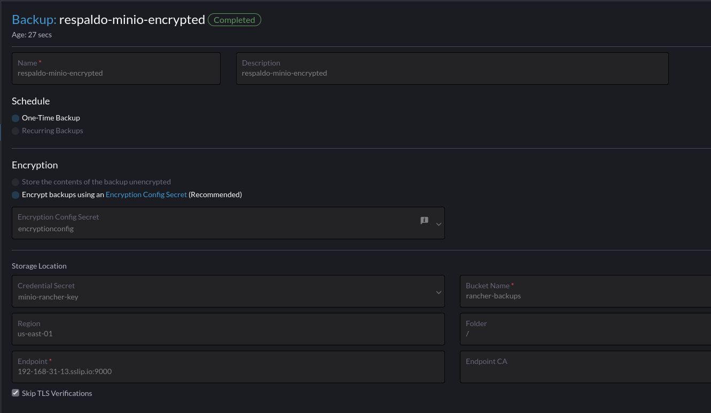

# Rancher Backup operator


```sh
# Add helm charte repository
helm repo add rancher-charts https://charts.rancher.io
helm repo update
```

```sh
# Install CRDs
helm install --wait \
    --create-namespace -n cattle-resources-system \
    rancher-backup-crd rancher-charts/rancher-backup-crd
```

```sh
# Install rancher-backup
helm install --wait \
    -n cattle-resources-system \
    rancher-backup rancher-charts/rancher-backup
```

# Install from Rancher Apps
Install from Rancher, Local, Apps, Charts, Rancher Backups.

# Configure minio encrypted rancher backup




# Referencias
- https://ranchermanager.docs.rancher.com/pages-for-subheaders/backup-restore-configuration
- https://ranchermanager.docs.rancher.com/reference-guides/backup-restore-configuration/examples
- https://kubernetes.io/docs/tasks/administer-cluster/encrypt-data/#understanding-the-encryption-at-rest-configuration
- https://github.com/rancher/backup-restore-operator
- https://github.com/rancher/backup-restore-operator/blob/master/README.md
